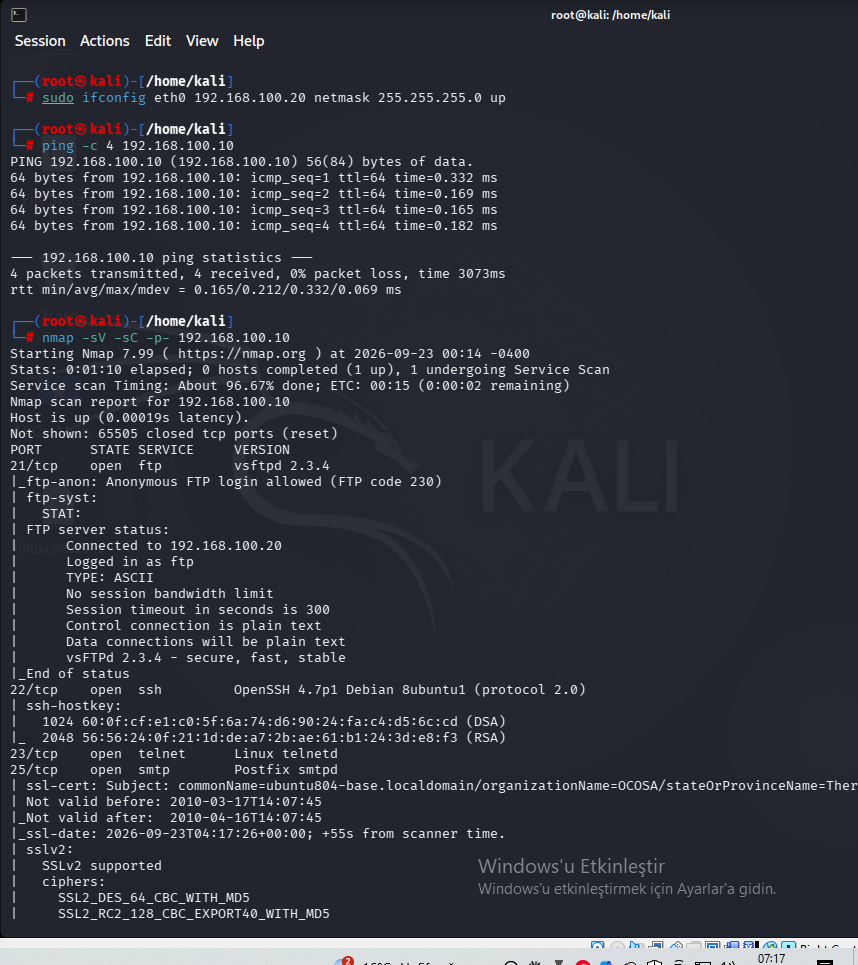
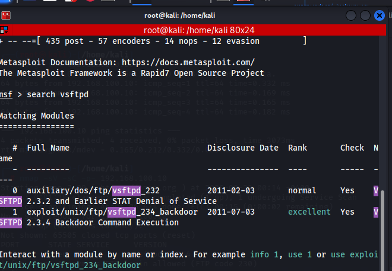
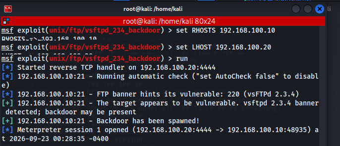
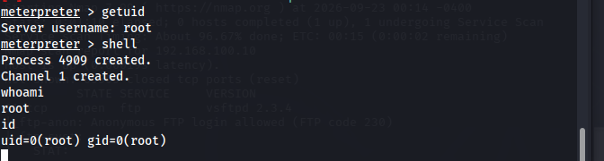
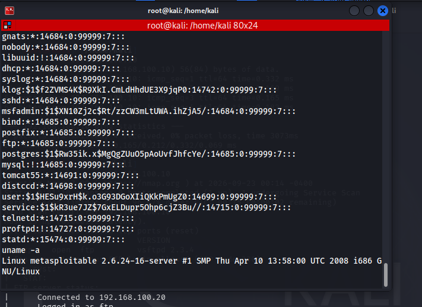
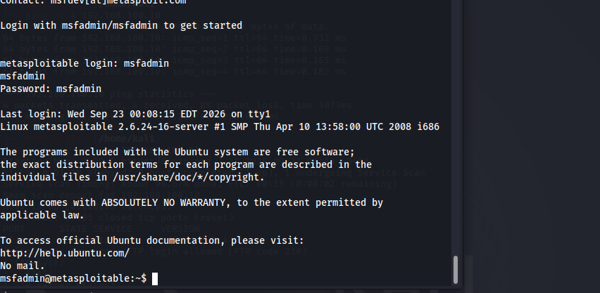

# 🛡️ Metasploitable2 Penetration Test Report

> Educational penetration test against a deliberately vulnerable lab machine (Metasploitable2), performed in an isolated VirtualBox network using Kali Linux. Documented as part of my hands-on cybersecurity / penetration testing self-study.

## Table of Contents

- [Executive Summary](#executive-summary)
- [Scope](#scope)
- [Methodology](#methodology)
- [Findings Summary](#findings-summary)
- [F-01: vsftpd 2.3.4 Backdoor Command Execution (Critical)](#f-01-vsftpd-234-backdoor-command-execution-critical)
- [F-02: Telnet Cleartext Authentication (Medium)](#f-02-telnet-cleartext-authentication-medium)
- [Overall Assessment](#overall-assessment)
- [Risk Rating Scale](#risk-rating-scale)
- [Lab Setup](#lab-setup)
- [Disclaimer](#disclaimer)

## Executive Summary

This report documents a penetration test carried out against **Metasploitable2**, an intentionally vulnerable Linux virtual machine used for security training, inside an isolated lab network. The goal was to identify and exploit real-world vulnerabilities using an industry-standard methodology (recon → enumeration → exploitation → post-exploitation), and to practice professional reporting.

Two notable findings were identified: one **Critical** and one **Medium** severity issue. The critical finding allows an unauthenticated attacker to execute arbitrary commands and obtain full root access on the target system.

## Scope

| Item | Detail |
|---|---|
| **Target IP** | `192.168.100.10` (Metasploitable2) |
| **Attacking Machine** | Kali Linux (`192.168.100.20`) |
| **Network** | VirtualBox Internal Network (isolated, no internet access) |
| **Test Type** | Black box — no prior credentials or internal knowledge |

This engagement was performed entirely in a personal, isolated lab environment against a purpose-built vulnerable training image. It does not target any production or third-party system.

## Methodology

1. **Reconnaissance** — identify live hosts and open ports
2. **Enumeration** — fingerprint services and versions with Nmap
3. **Vulnerability Analysis** — match service versions against known CVEs
4. **Exploitation** — leverage Metasploit Framework to exploit identified vulnerabilities
5. **Post-Exploitation** — verify and document the level of access obtained (`whoami`, `id`, `/etc/shadow`)

## Findings Summary

| ID | Finding | Service / Port | Severity |
|---|---|---|---|
| F-01 | vsftpd 2.3.4 Backdoor Command Execution | 21/tcp (FTP) | 🔴 Critical |
| F-02 | Telnet Cleartext Authentication | 23/tcp (Telnet) | 🟠 Medium |

---

## F-01: vsftpd 2.3.4 Backdoor Command Execution (Critical)

| | |
|---|---|
| **Affected Service** | vsftpd 2.3.4 — 21/tcp (FTP) |
| **CVE** | CVE-2011-2523 |
| **CVSS (approx.)** | 10.0 (Critical) |

### Description

*Figure 1 — Nmap scan identifying vsftpd 2.3.4 on port 21*

An Nmap scan revealed the target was running **vsftpd 2.3.4** on port 21. This specific version was maliciously modified after the official source was compromised in 2011: when a username containing `:)` is submitted during FTP login, the backdoored binary opens an unauthenticated command shell on TCP port `6200`.

### Exploitation

*Figure 2 — Locating the exploit module in Metasploit*

The Metasploit module `exploit/unix/ftp/vsftpd_234_backdoor` was used to exploit the vulnerability.

*Figure 3 — Running the exploit; a Meterpreter session is opened*

The exploit successfully returned a shell running as **root**.

*Figure 4 — `getuid`, `whoami` and `id` confirming root-level access (uid=0)*

The commands above confirm the obtained shell runs with UID 0 (root) — full administrative access.

*Figure 5 — Reading `/etc/shadow` with root privileges*

With root access, the `/etc/shadow` file (containing all user password hashes) was also read, further demonstrating full system compromise.

### Impact

An unauthenticated attacker can gain full root-level command execution on the target with zero credentials. This constitutes a complete compromise of the host, enabling data theft, persistence, and lateral movement into the rest of the network.

### Remediation

- Immediately upgrade vsftpd to a current, officially-sourced release (3.x or later).
- Always verify checksums/signatures when downloading software.
- Establish routine vulnerability scanning and version tracking for exposed services.
- Disable FTP entirely if not required; prefer SFTP/FTPS if file transfer is needed.

---

## F-02: Telnet Cleartext Authentication (Medium)

| | |
|---|---|
| **Affected Service** | Linux telnetd — 23/tcp |
| **CVSS (approx.)** | 5.9 (Medium) |

### Description

*Figure 6 — Telnet login; username and password are visible in plaintext*

Port 23 (Telnet) was found open on the target. Telnet transmits all traffic — including usernames and passwords — in **plaintext**. Any attacker positioned on the same network segment can trivially capture credentials via traffic sniffing.

### Impact

An attacker able to observe network traffic can obtain valid credentials without any cracking effort, leading to unauthorized access and credential theft.

### Remediation

- Disable Telnet; use **SSH** for all remote administration.
- If Telnet must remain for legacy reasons, tunnel it through a VPN.
- Apply network segmentation to limit exposure of sensitive services.

---

## Overall Assessment

The target system runs outdated software with publicly known, critical vulnerabilities. Finding F-01 alone demonstrates that the host can be fully compromised without any authentication. In a production environment, findings of this severity could lead to significant data breaches and reputational damage.

**Recommendation:** implement a regular patch-management process, retire legacy cleartext protocols (Telnet, FTP), and validate security posture through periodic penetration testing.

## Risk Rating Scale

| Severity | Description |
|---|---|
| 🔴 **Critical** | Leads directly to full system compromise or major data loss; requires immediate remediation. |
| 🟠 **Medium** | Does not directly compromise the system but expands the attack surface or may leak sensitive data. |
| 🟢 **Low** | Limited impact on its own, but may increase risk when chained with other findings. |

## Lab Setup

- **Attacker:** Kali Linux (VirtualBox VM)
- **Target:** Metasploitable2 (VirtualBox VM)
- **Network:** VirtualBox Internal Network, static IPs (no DHCP/internet)
- **Tools used:** Nmap, Metasploit Framework, 

## Disclaimer

This test was performed exclusively against a personal, isolated lab environment using **Metasploitable2**, a virtual machine intentionally built with known vulnerabilities for training purposes. No production systems or third-party assets were involved. This repository is for educational and portfolio purposes only.

---

*Author: [v3x0rdll] — Aspiring Penetration Tester*
