# 🛡️ CorpNet NOC Portal Penetration Test Report

> Educational penetration test against the "Silent Monitor" room (TryHackMe), a deliberately vulnerable web application simulating a Network Operations Centre (NOC) portal. Documented as part of my hands-on cybersecurity / penetration testing self-study.


## Table of Contents

- [Executive Summary](#executive-summary)
- [Scope](#scope)
- [Methodology](#methodology)
- [Findings Summary](#findings-summary)
- [F-01: SQL Injection — Authentication Bypass (Critical)](#f-01-sql-injection--authentication-bypass-critical)
- [F-02: OS Command Injection in Host Health Probe (Critical)](#f-02-os-command-injection-in-host-health-probe-critical)
- [F-03: Credential Reuse Leading to SSH Access (High)](#f-03-credential-reuse-leading-to-ssh-access-high)
- [F-04: Weak Master Password on KeePass Backup Database (High)](#f-04-weak-master-password-on-keepass-backup-database-high)
- [F-05: Privilege Escalation to Root via Credential Recovery (Critical)](#f-05-privilege-escalation-to-root-via-credential-recovery-critical)
- [Attack Chain](#attack-chain)
- [Overall Assessment](#overall-assessment)
- [Risk Rating Scale](#risk-rating-scale)
- [Lab Setup](#lab-setup)
- [Disclaimer](#disclaimer)

## Executive Summary

This report documents a penetration test carried out against the **Silent Monitor** target machine (TryHackMe), a NOC (Network Operations Centre) portal intentionally built with a chained set of vulnerabilities for security training. The goal was to identify and exploit real-world web and system vulnerabilities using an industry-standard methodology (recon → enumeration → exploitation → post-exploitation → privilege escalation), and to practice professional reporting.

Five findings were identified across the engagement: three **Critical** and two **High** severity issues. The chain begins with an authentication bypass in the web login form and ends in full root-level compromise of the underlying host, driven by a plaintext credential leak, credential reuse, and a weakly-protected password vault.

## Scope

| Item | Detail |
|---|---|
| **Target IP** | `10.112.141.210` |
| **Attacking Machine** | Kali Linux |
| **Exposed Services** | 22/tcp (SSH), 5050/tcp (HTTP — Werkzeug/Flask, "CorpNet NOC Portal") |
| **Test Type** | Black box — no prior credentials or internal knowledge |

This engagement was performed against a purpose-built vulnerable training target (TryHackMe "Silent Monitor" room). It does not target any production or third-party system.

## Methodology

1. **Reconnaissance** — port scanning and directory enumeration (`nmap`, `gobuster`)
2. **Enumeration** — web application review, audit log analysis
3. **Exploitation** — authentication bypass, remote code execution
4. **Credential Access** — plaintext config disclosure, password vault cracking
5. **Post-Exploitation** — lateral movement (SSH) and privilege escalation to root

## Findings Summary

| ID | Finding | Location | Severity |
|---|---|---|---|
| F-01 | SQL Injection — Authentication Bypass | `POST /internal/login` | 🔴 Critical |
| F-02 | OS Command Injection (RCE) | `POST /internal/health` | 🔴 Critical |
| F-03 | Credential Reuse Leading to SSH Access | SSH (22/tcp) | 🟠 High |
| F-04 | Weak Master Password on KeePass Backup | `~/backups/infrastructure.kdbx` | 🟠 High |
| F-05 | Privilege Escalation to Root | Local (`su`) | 🔴 Critical |

---

## F-01: SQL Injection — Authentication Bypass (Critical)

| | |
|---|---|
| **Affected Endpoint** | `POST /internal/login` — `username` parameter |
| **Vulnerability Class** | CWE-89 (SQL Injection) |
| **CVSS (approx.)** | 9.8 (Critical) |

### Description

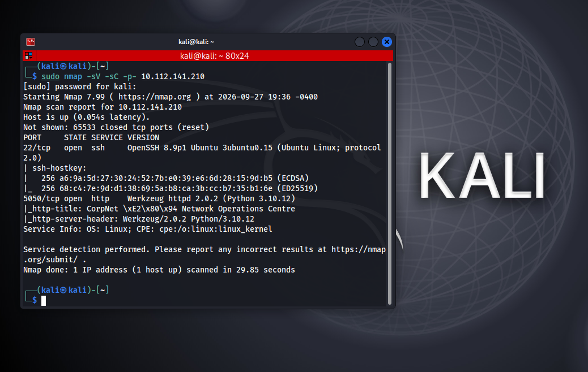
*Figure 1 — Nmap scan identifying SSH (22) and the Werkzeug/Flask NOC portal (5050)*

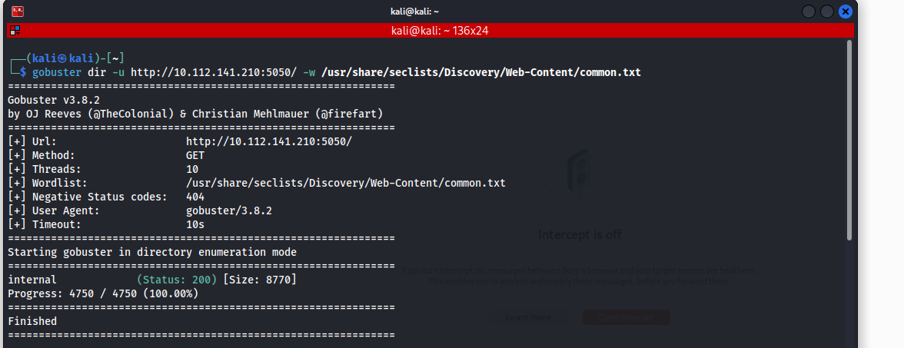
*Figure 2 — Directory enumeration with Gobuster revealing the `/internal` path*

The `/internal` login form's `username` field is concatenated directly into a backend SQL query without sanitization or parameterization, allowing authentication bypass via a boolean-based SQL injection payload.

### Exploitation

The following payload was submitted in the **Username** field, with any value in **Password**:

```
' or 1=1 -- -
```

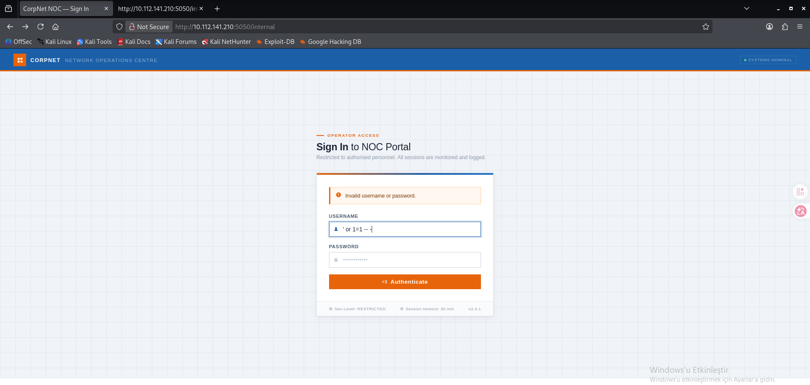
*Figure 3 — SQLi payload bypassing authentication*

### Impact

Authentication succeeds and the attacker is logged in as the `netops` operator account with no valid credentials, gaining full access to the NOC portal dashboard.

### Remediation

- Use parameterized queries / prepared statements for all authentication logic.
- Never concatenate user input into SQL strings.
- Apply input validation and least-privilege database accounts.

---

## F-02: OS Command Injection in Host Health Probe (Critical)

| | |
|---|---|
| **Affected Endpoint** | `POST /internal/health` — `target` parameter |
| **Vulnerability Class** | CWE-78 (OS Command Injection) |
| **CVSS (approx.)** | 9.8 (Critical) |

### Description

The dashboard's Audit Log exposed a previous injection attempt made by another operator session, hinting at the vulnerability:

```
netops | HEALTH_CHECK | 127.0.0.1%0awhoami
```

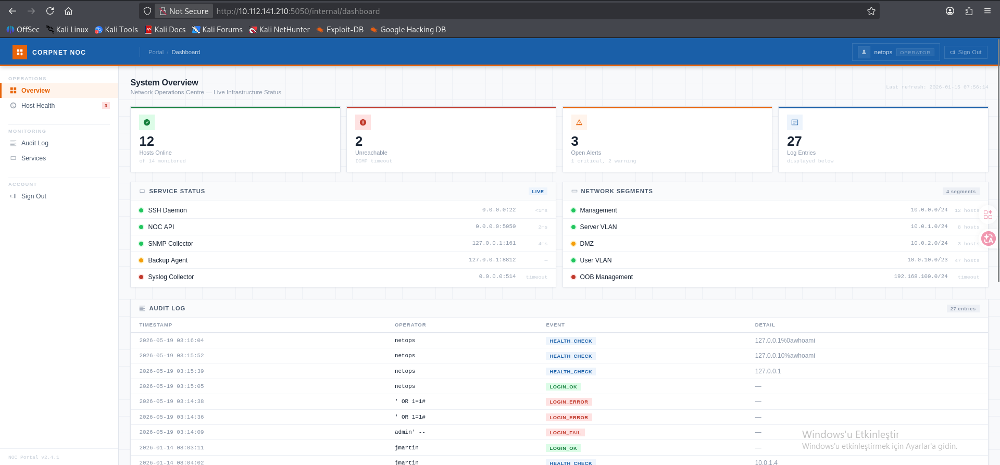
*Figure 4 — Audit log entry hinting at command injection via `%0a` (newline)*

The "Host Health Check" feature passes the user-supplied `target` value directly into a shell `ping` command without sanitization. Injecting a newline followed by an arbitrary command results in remote code execution as `www-data`.

### Exploitation

The following was submitted in the **Target Hostname or IP Address** field:

```
127.0.0.1
whoami
```

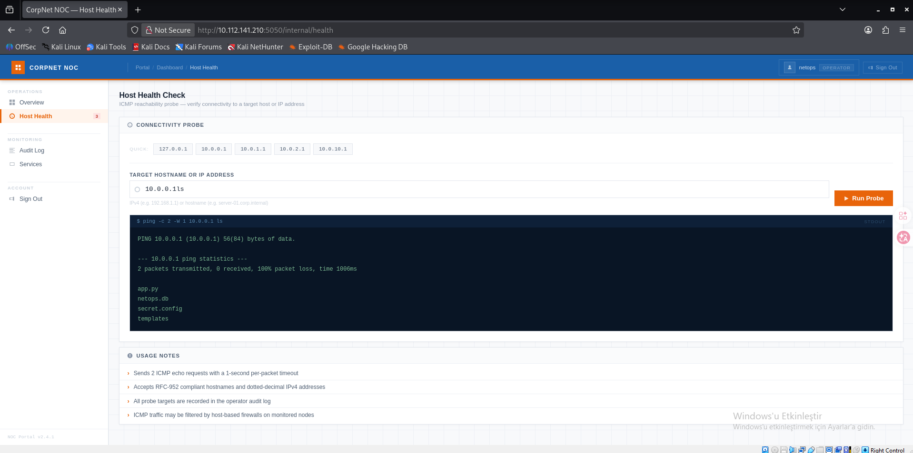
*Figure 5 — Injected `whoami` executes; output rendered alongside the ping result*

Further enumeration of the application directory led to disclosure of a plaintext credential inside `secret.config`:

```
target=10.0.0.1
cat secret.config
```

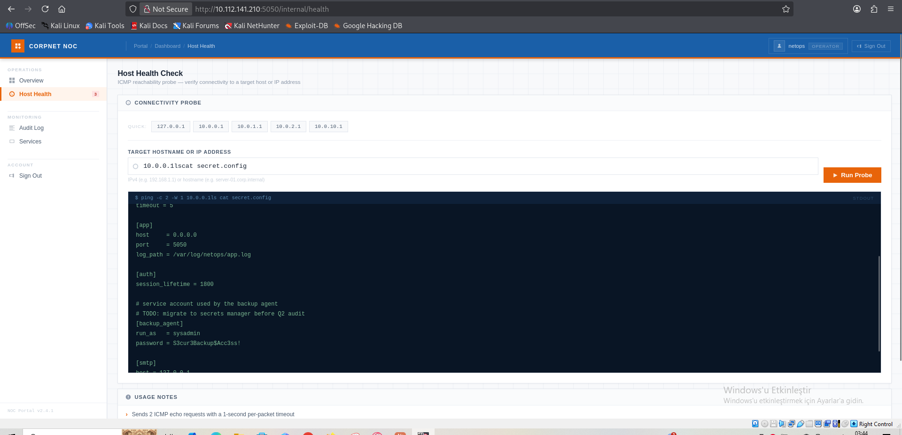
*Figure 6 — `secret.config` reveals the `backup_agent` service account credential*

```ini
[backup_agent]
run_as   = sysadmin
password = S3cur3Backup$Acc3ss!
```

### Impact

Full remote code execution as `www-data`, and disclosure of a valid credential for the `sysadmin` OS-level user — enabling lateral movement (see F-03).

### Remediation

- Never pass user input to a shell command; use language-native libraries instead of shelling out to `ping`.
- If shelling out is unavoidable, strictly validate input (e.g. RFC-952 hostname / dotted IPv4 regex) and invoke the subprocess with an argument array (`shell=False`) — never string interpolation.
- Do not store plaintext credentials in application configuration files; use a secrets manager.

---

## F-03: Credential Reuse Leading to SSH Access (High)

| | |
|---|---|
| **Affected Service** | OpenSSH — 22/tcp |
| **Vulnerability Class** | CWE-798 (Use of Hard-coded / Reused Credentials) |
| **CVSS (approx.)** | 8.1 (High) |

### Description

The `backup_agent` credential disclosed in F-02 was valid for interactive SSH login as the `sysadmin` user, despite being documented in the config file as a service account intended for automated backups only.

### Exploitation

```bash
ssh sysadmin@10.112.141.210
# Password: S3cur3Backup$Acc3ss!
```

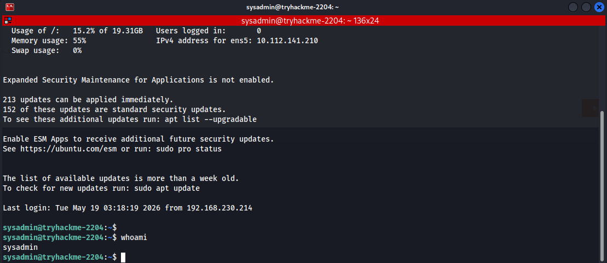
*Figure 7 — `whoami` confirming interactive shell access as `sysadmin`*

### Impact

Lateral movement from web application compromise to full OS-level interactive user access.

### Remediation

- Enforce non-interactive-only credentials for service/automation accounts (`nologin` shell, key-restricted SSH).
- Rotate credentials immediately after any suspected disclosure.

---

## F-04: Weak Master Password on KeePass Backup Database (High)

| | |
|---|---|
| **Affected Asset** | `/home/sysadmin/backups/infrastructure.kdbx` (KeePass KDBX v4) |
| **Vulnerability Class** | CWE-521 (Weak Password Requirements) |
| **CVSS (approx.)** | 7.5 (High) |

### Description

A KeePass password database containing a "Root User Password - Sensitive" entry was discovered in the `sysadmin` user's backup directory. The database was protected only by a weak, dictionary-crackable master password.

### Exploitation

```bash
ls -la ~/backups/
```

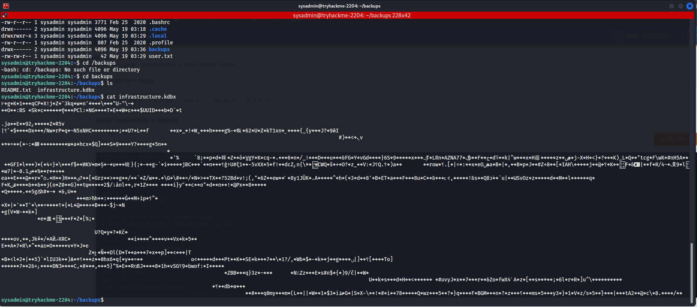
*Figure 8 — `infrastructure.kdbx` found alongside a `README.txt` in the backups directory*

```bash
git clone https://github.com/r3nt0n/keepass4brute
sudo apt install keepassxc
cd keepass4brute
./keepass4brute.sh ~/infrastructure.kdbx /usr/share/wordlists/rockyou.txt
```

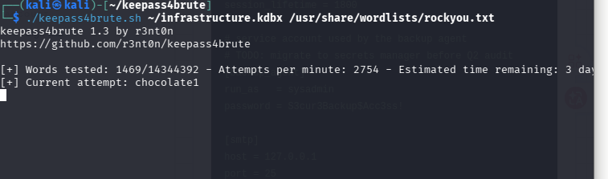
*Figure 9 — Dictionary attack against the KDBX master password using `keepass4brute`*

The master password was recovered: **`spring`**

```bash
keepassxc-cli show infrastructure.kdbx "Root User Password - Sensitive" -a Password
```

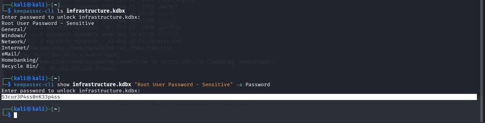
*Figure 10 — Root credential extracted from the unlocked vault*

### Impact

Recovery of the root password enables full privilege escalation on the host (see F-05).

### Remediation

- Enforce a strong master password policy (minimum length/entropy, not a dictionary word) for any credential vault.
- Restrict file-system permissions on backup files containing sensitive vaults; do not leave them world/group-readable to non-privileged local users.

---

## F-05: Privilege Escalation to Root via Credential Recovery (Critical)

| | |
|---|---|
| **Affected Asset** | Local privilege boundary (`su`) |
| **Vulnerability Class** | CWE-522 (Insufficiently Protected Credentials) |
| **CVSS (approx.)** | 9.1 (Critical) |

### Description

The root password recovered from the KeePass database (F-04) was valid, providing full root access on the host.

### Exploitation

```bash
su root
# Password: S3cur3P4ss0nK33p4ss
```

```bash
cat /root/root.txt
```

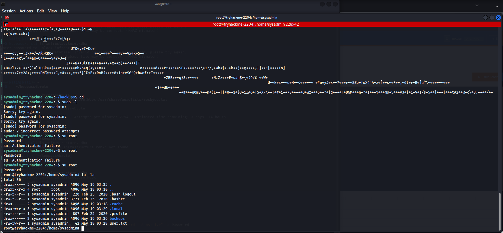
*Figure 11 — Root shell obtained; `/root/root.txt` read*

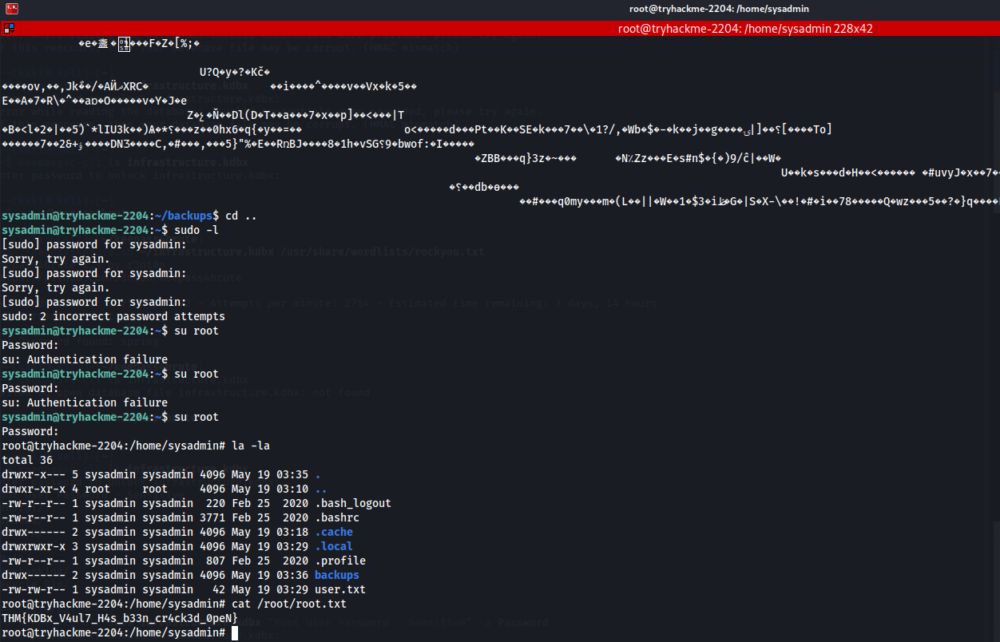
*Figure 12 — Root flag: `THM{KDBx_V4ul7_H4s_b33n_cr4ck3d_0peN}`*

### Impact

Complete compromise of the target system.

### Remediation

- Rotate the root password.
- Apply defense-in-depth: restrict direct root logins where possible; prefer `sudo` with per-user authentication and logging over shared root passwords.

---

## Attack Chain

```
Recon (nmap + gobuster)
   → SQL Injection (F-01: auth bypass)
   → Audit log review (post-auth recon)
   → OS Command Injection (F-02: RCE as www-data)
   → secret.config credential disclosure
   → SSH access as sysadmin (F-03: credential reuse)
   → infrastructure.kdbx discovered
   → keepass4brute dictionary attack (F-04: weak master password → "spring")
   → Root password extracted from vault
   → su root (F-05: privilege escalation) → root.txt captured
```

## Overall Assessment

The target application chains a classic web-tier vulnerability (SQL injection) with a more severe server-side flaw (command injection) to achieve initial code execution, then pivots through credential disclosure and reuse into a full compromise of the host, ultimately reaching root. Each individual finding is serious on its own, but the chain as a whole demonstrates how a single unsanitized input field in a web form can cascade into total system compromise.

**Recommendation:** apply input validation and parameterized queries across all application entry points, eliminate plaintext credentials from configuration files, enforce strong master-password policies for credential vaults, and apply least-privilege / credential-rotation practices for service accounts.

## Risk Rating Scale

| Severity | Description |
|---|---|
| 🔴 **Critical** | Leads directly to full system compromise or major data loss; requires immediate remediation. |
| 🟠 **High** | Significantly expands attacker capability or directly enables further compromise. |
| 🟢 **Low** | Limited impact on its own, but may increase risk when chained with other findings. |

## Lab Setup

- **Attacker:** Kali Linux
- **Target:** TryHackMe "Silent Monitor" room (`10.112.141.210`)
- **Tools used:** Nmap, Gobuster, Burp Suite, OpenSSH client, `keepass4brute`, KeePassXC CLI

## Disclaimer

This test was performed exclusively against the TryHackMe "Silent Monitor" training environment, a virtual machine intentionally built with known vulnerabilities for educational purposes. No production systems or third-party assets were involved. This repository is for educational and portfolio purposes only.

---

*Author: v3x0rdll — Aspiring Penetration Tester*
